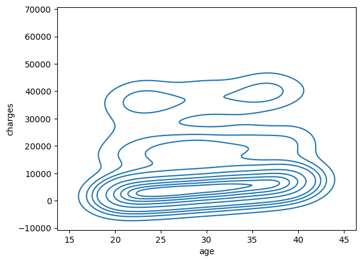

# Final Group Report 21

## Introduction

All of us have grown up having our parents take care of our insurances, whether it be a medical insurance, life insurance, or home insurance. We have been ignorant about these matters most of our lives because we never had to bear these costs on our own. This changed for us after we came to Canada as International Students. We have since then realised how costly it can be to cover Medical Insurance for just oneself. Insurance is incredibly important to protect one’s family, properties, financial losses and even high medical costs and emergencies. When exploring this dataset, we discovered that there may be various factors such as one's demographic or medical index that correlates to differences in the insurance costs billed to them. We were interested in digging deeper into these data points and analyzing such relationships that may exist between some of these factors and the total charges.

## Exploratory Data Analysis

This is a visualization of the data analysis of numerical values in the dataset, containing key information such as mean, standard deviation, min and max values of Medical Charges incurred. This provided a general outlook on how numerical data values in the set may be correlated to one another along with the perspective of average values and degree of variance within each numeric category.

The correlation matrix converts all data types to a numeric form and shows how strong the correlations between any two given columns are. This makes it easy to identify potential relationships between categories. As you can see, there is a strong correlation between smoking and charges, somewhat of a correlation between age and charges and bmi and charges.

The pairplot visualization further improves our confidence in the correlational strength seen in the matrices by providing a visual aspect to the trend. They can be seen explicitly in the age to charges plot and somewhat in the bmi to charges plot.

## Research Question 1 + Result

## Research Question 2 + Result

Q2: The research question is to establish a relationship between BMI and medical insurance costs for people aged between 20 and 40.

[You can find the full analysis notebook here, along with the code and data here](notebooks/analysis2a.ipynb)

A2: The overall conclusion to the research question stands that **there is no distinguishable relationship solely between BMI and charges**, with random hikes in charges being observed for all ages. This is possibly because many other factors in the original data, such as children, sex, smoker, and region, contribute to fluctuations in the medical insurance costs from person to person.

In general, for the BMI range of 20-45 and age range of 20-40, the charges ranged from $0-10000.

For reasons inconclusive, the BMI range of 25-30 and age range of 20-40 sees a hike in the associated charges, ranging from $10000-20000.

For reasons inconclusive, the BMI range of 30-40 and the age-range of 20-40 sees a hike in the associated charges, ranging from $30000-40000.

## Research Question 3 + Result
a) Is there a significant difference in medical costs billed between a smoker and a non-smoker?

There is a noticeably higher amount of medical insurance charges associated with smokers compared to non-smokers. There is a significant difference in the total medical costs of an individual between a smoker and a non-smoker. To understand if the data is statistically significant, an independent samples t-test has to be done by studying the hypotheses stated above.

b) Is there a positive correlation between an individual's age and the medical costs billed by health insurance?

There is a positive linear correlation between an individual's age and the medical costs billed by health insurance. In other words, medical insurance costs are higher with increasing age. To find the effect size of this correlation, a Pearson's correlation test has to be done to study the hypotheses stated above. In the future, this research question could be studied more in-depth with other factors such as BMI or gender which may interact with age to result in particular medical bills.s such as bmi or gender which may interact with age to result in particular medical bills.

## Summary/Conclusion

Through analysing this dataset, we were able to make multiple conclusions on how one's demographic or attribute affects their medical costs billed by health insurance. A common finding was that the beneficiary's charges were with increasing age. Another factor that played into higher costs was that the medical insurance costs of a smoker compared to a non-smoker was substantially higher. Additionally, while we found that the beneficiary's bmi alone had no significant effect on the insurance charges, there were clear distinctions when those bmi's were separated into categories and combined with factors such as smoking. Our data illustrated that obese smokers pay the highest amount of bills compared to the rest of the dataset. Furthermore, we discovered that smoking contributes more than obesity as a factor because non-obese smokers pay more than double the amount that obese non-smokers do. Overall, we concluded that apart from the medical insurance bills increasing with age, there are other health factors such as obesity and smoking that play a much more important role.
